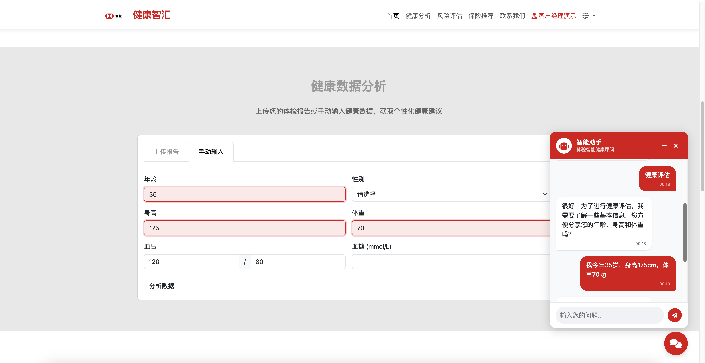
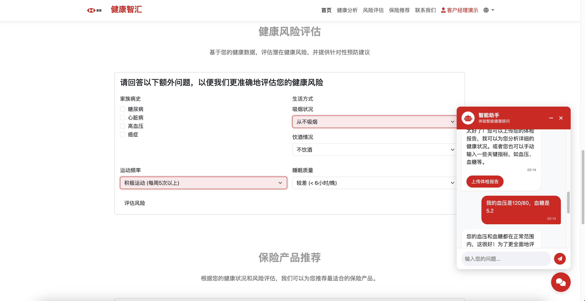
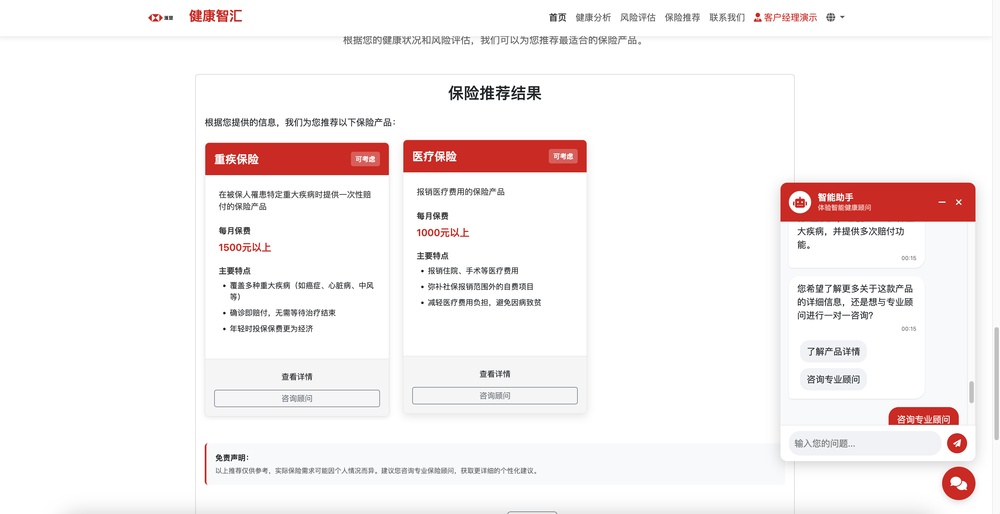
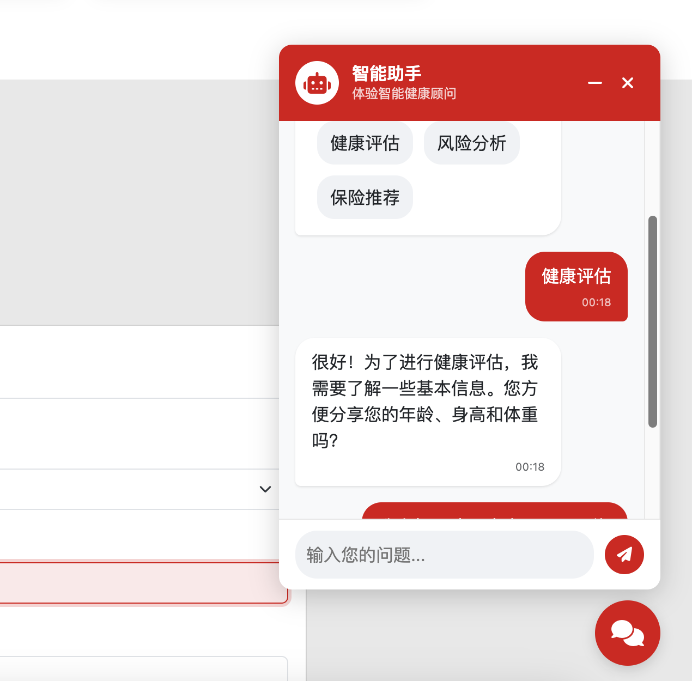
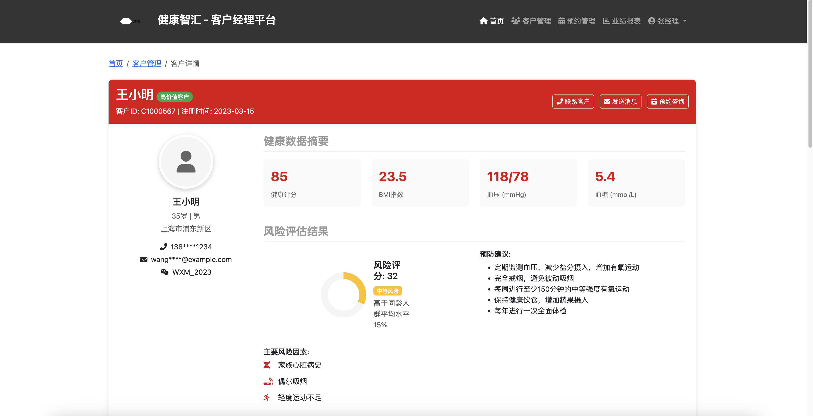
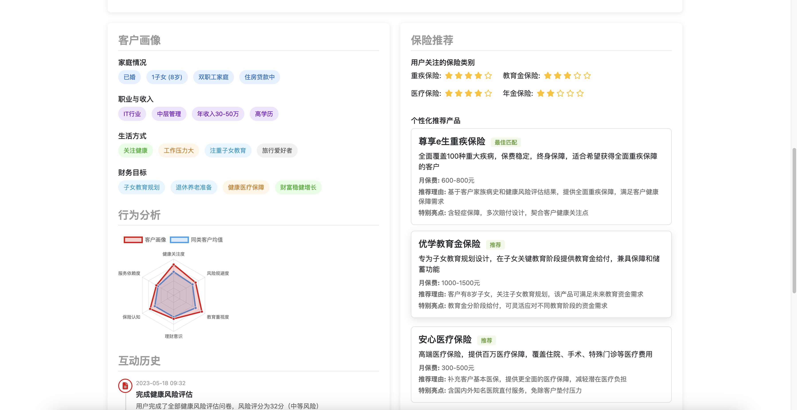
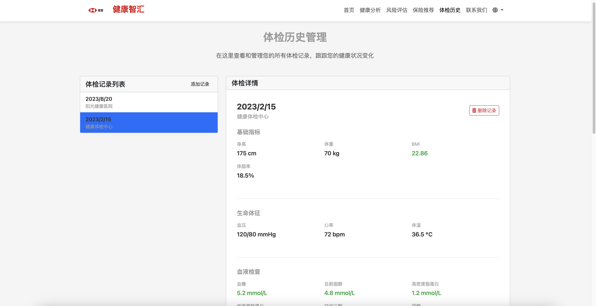

# Health Smart Hub

  
  <h3>Intelligent Health and Wealth Planning Platform</h3>
  
Transforming insurance customer experience and business processes through generative AI technology

  
This document and DEMO were collaboratively created by ChatGPT o3-mini, Claude 3.7 sonnet, Deepseek-r1, Grok3, and Cursor.

  
Demo images from Pexels Chevanon Photography[https://www.pexels.com/zh-cn/photo/317157/]

## 📋 Table of Contents

- [Project Overview](#project-overview)
- [Core Features (6)](#core-features)
- [Business Value](#business-value)
- [Technical Implementation](#technical-implementation)
- [Business Outcomes](#business-outcomes)
- [Demo and Screenshots](#demo-and-screenshots)
- [Future Development](#future-development)
- [Online Demo](#online-demo)

## 🌟 Project Overview

**Health Smart Hub** is an innovative intelligent health and wealth planning platform that deeply integrates health management and insurance services through generative AI technology, providing customers with personalized health analysis, risk assessment, and insurance recommendations. The platform not only helps customers better understand and manage their health conditions but also provides precise insurance product recommendations based on customers' health data and lifestyle habits, achieving seamless integration of health management and wealth planning.

### Strategic Alignment

- **Customer-Centric Strategy**: Enhance customer experience and satisfaction through AI-driven personalized services
- **Digital Transformation**: Drive digitalization and intelligence of insurance business processes using advanced AI technology
- **Health Ecosystem**: Build a closed-loop ecosystem of health management and insurance services to enhance customer stickiness
- **Data-Driven Decision Making**: Achieve precise marketing and product recommendations based on customer health data

## 💡 Core Features

### 1. AI-Driven Health Data Analysis

  

- **Feature Description**: Provides personalized health advice including dietary adjustments, exercise plans, and lifestyle improvements based on customer-uploaded health examination reports or manually input health data (such as age, BMI, blood pressure, blood glucose, etc.) using generative AI technology.
- **GenAI Application**: Uses large language models (LLM) to analyze health examination report text, extract key health indicators, and generate personalized health recommendations.
- **Technical Highlights**:
  - Supports OCR recognition of uploaded health examination report images/PDFs
  - Utilizes RAG technology to connect with professional medical knowledge bases
  - Multi-modal analysis capabilities, integrating text, images, and structured data

### 2. Intelligent Health Risk Assessment

  

- **Feature Description**: Analyzes customer health data and lifestyle habits to assess potential health risks and provide corresponding prevention recommendations. The system can also generate shareable cards with social attributes to encourage users to share their health achievements.
- **GenAI Application**: Uses AI models to predict health risks and generate personalized prevention recommendations and visually appealing sharing content.
- **Technical Highlights**:
  - Machine learning-based health risk prediction models
  - Intelligent generation of social media-friendly sharing cards
  - Automatic adjustment of content style based on user age group and preferences

### 3. Personalized Insurance Product Recommendations

  

- **Feature Description**: Recommends the most suitable insurance product combinations based on the customer's life stage, financial goals, and health status.
- **GenAI Application**: Utilizes RAG technology to connect with product catalogs and generate personalized insurance plans based on customer profiles.
- **Technical Highlights**:
  - Multi-dimensional customer profile construction
  - Insurance needs prediction based on health risks
  - Dynamic insurance portfolio optimization algorithm

### 4. Intelligent Customer Advisor Dialogue System

  

- **Feature Description**: Guides customers through the entire health assessment and insurance consultation process through a natural language dialogue interface, providing 24/7 instant responses.
- **GenAI Application**: Dialogue system based on large language models that can understand customer intent and provide professional consultation.
- **Technical Highlights**:
  - Multi-turn dialogue management
  - Sentiment analysis and personalized responses
  - Seamless integration with human customer service

### 5. Customer Manager Intelligent Dashboard

  

  

- **Feature Description**: Provides insurance customer managers with comprehensive customer management tools, integrating customer health data, risk assessment results, and insurance needs to support precise sales and service.
- **GenAI Application**: Uses AI technology to automatically generate customer profiles, sales recommendations, and follow-up strategies to improve customer manager efficiency.
- **Technical Highlights**:
  - 360° customer view, comprehensively displaying customer health and financial status
  - AI-driven sales opportunity identification and prioritization
  - Intelligent conversation script generation, providing personalized communication suggestions based on customer characteristics
  - Automated customer follow-up reminders and action recommendations
  - Seamless integration with MCP system for automatic data entry

### 6. Health Examination History Management and Health Trend Analysis

  

- **Feature Description**: Provides management and visualization functions for health examination history records, helping users track changes in health indicators and achieve long-term health management.
- **GenAI Application**: Uses AI to analyze health examination data over the years, identify health trends and potential risks, and generate personalized health improvement recommendations.
- **Technical Highlights**:
  - Multi-source data integration, supporting manual entry and authorized acquisition from medical institutions
  - Health indicator trend visualization, intuitively displaying changes
  - Intelligent anomaly detection, timely discovery of abnormal changes in health indicators
  - Health prediction model based on historical data

- **Data Analysis Functions**:
  - Historical trend charts of key health indicators (blood pressure, blood glucose, cholesterol, etc.)
  - Weight and BMI change tracking
  - Health score historical changes
  - Comparative analysis with health data of people of the same age
  - Health predictions based on historical data

## 💼 Business Value

### 1. Enhance Customer Acquisition and Conversion

- **Digital Customer Acquisition Channel**: Attract potential customers through health management entry points, reducing customer acquisition costs
- **Conversion Rate Improvement**: Personalized insurance recommendations increase product conversion rates, expected to improve by 25-30%
- **Customer Segmentation**: Achieve precise customer segmentation based on health data and risk assessment, optimizing marketing strategies

### 2. Enhance Customer Experience and Stickiness

- **Personalized Service**: AI-driven personalized health advice and insurance recommendations enhance customer satisfaction
- **Self-Service**: 24/7 intelligent advisor service reduces waiting time
- **Health Ecosystem**: Build a closed-loop ecosystem of health management and insurance services to enhance customer stickiness

### 3. Optimize Business Operation Efficiency

- **Sales Process Automation**: Reduce manual intervention and improve sales efficiency
- **Intelligent Underwriting**: Optimize underwriting processes through intelligent risk assessment based on health data
- **Reduce Operating Costs**: AI automation reduces labor costs, expected to save 15-20% in operating expenses
- **Enhance Customer Manager Efficiency**: Intelligent dashboard provides sales lead prioritization and personalized communication suggestions, improving customer manager work efficiency by 50%

### 4. Data-Driven Product Innovation

- **Customer Insights**: Obtain deep customer insights from health data to guide product innovation
- **Risk Pricing Optimization**: Achieve more precise risk pricing based on health risk assessment
- **Personalized Product Design**: Develop customized insurance products based on customer needs and health status

## 🔧 Technical Implementation

### Technical Architecture

- **AI Models**: Large Language Models (LLM), RAG (Retrieval-Augmented Generation), MCP (Model Context Protocol)
- **Data Processing**: OCR text recognition, Natural Language Processing (NLP)
- **Security and Compliance**: Data encryption, privacy protection, compliance auditing

### Key AI Technology Applications

1. **Document Understanding and Information Extraction**
   - Use OCR and NLP technologies to extract structured health data from health examination reports
   - Application scenario: Automatically parse health examination reports and extract key health indicators

2. **Retrieval-Augmented Generation (RAG)**
   - Combine professional medical knowledge bases and insurance product libraries to generate accurate health advice and insurance recommendations
   - Application scenario: Personalized health advice, insurance product matching

3. **Multi-modal Interaction**
   - Analysis capabilities integrating text, images, and structured data
   - Application scenario: Health examination report parsing, health risk visualization

4. **Conversational AI**
   - Natural dialogue system based on large language models
   - Application scenario: Intelligent customer advisor, guided health assessment

## 📊 Business Outcomes

### Expected Quantitative Outcomes

| Business Indicator | Expected Improvement | Implementation Method |
|---------|---------|---------|
| Customer Acquisition Cost | Reduced by 30% | Attract potential customers through health management entry points |
| Product Conversion Rate | Improved by 25-30% | Personalized insurance recommendations |
| Customer Satisfaction | Improved by 40% | AI-driven personalized service experience |
| Operating Costs | Reduced by 15-20% | Sales and service process automation |
| Customer Retention Rate | Improved by 35% | Closed-loop ecosystem of health management and insurance services |
| Cross-selling Rate | Improved by 45% | Precise product recommendations based on health data |
| Customer Manager Efficiency | Improved by 50% | Sales lead prioritization and communication suggestions provided by intelligent dashboard |

### Non-quantitative Outcomes

- **Brand Image Enhancement**: Demonstrate HSBC Insurance's leadership in digital innovation
- **Data Asset Accumulation**: Build a health database as a foundation for future product innovation
- **Ecosystem Expansion**: Lay the foundation for cooperation with medical institutions and health service providers
- **Market Differentiation**: Achieve market differentiation through AI-driven health management services

## 🚀 Future Development

### Short-term Planning (6-12 months)

- **Health Data Integration**: Collaborate with more medical institutions and health device manufacturers to expand data sources
- **AI Model Optimization**: Continuously optimize health risk assessment and insurance recommendation algorithms based on user feedback
- **Multi-language Support**: Expand support for more languages to meet global market demands

### Medium to Long-term Planning (1-3 years)

- **Ecosystem Expansion**: Integrate more health service providers to build a complete health ecosystem
- **Advanced Analysis Functions**: Introduce predictive health analysis to provide early warnings of potential health risks
- **Personalized Insurance Products**: Develop customized insurance products based on platform data
- **International Market Expansion**: Replicate the platform model to other countries and regions

## 📝 Conclusion

The **Health Smart Hub** platform achieves deep integration of health management and insurance services through generative AI technology, providing customers with comprehensive health and wealth planning solutions. The platform not only helps HSBC Insurance enhance customer experience, optimize business processes, and reduce operating costs, but also drives product innovation and market differentiation through data-driven approaches, winning competitive advantages for the company in the wave of digital transformation.

By applying GenAI technology to specific insurance scenarios, the **Health Smart Hub** platform perfectly aligns with HSBC Insurance's strategic priorities, creates clear business value, and supports the achievement of key business outcomes. This innovative solution represents the future direction of digital transformation in the insurance industry and demonstrates HSBC Insurance's leadership in technological innovation.

## 🔗 Online Demo

You can access our online demo through the following links:

- [User Portal Homepage](index.html) - Experience the user interface of the Health Smart Hub platform, including health data analysis, risk assessment, and insurance recommendation functions
- [Health Examination History Management](health-records.html) - View health examination history record management and health trend analysis functions
- [Customer Manager Dashboard](advisor-dashboard.html) - Experience the intelligent dashboard designed specifically for insurance customer managers

> Note: The above demo links are for demonstration purposes only.

---

This document and DEMO were collaboratively created by ChatGPT o3-mini, Claude 3.7 sonnet, Deepseek-r1, Grok3, and Cursor.
Images from Pexels Chevanon Photography[https://www.pexels.com/zh-cn/photo/317157/] 